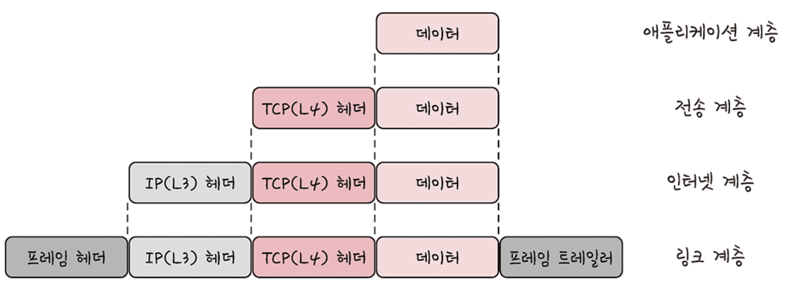

# internet protocol suite
> 인터넷에서 컴퓨터들이 서로 정보를 주고받는 데 쓰이는 프로토콜의 집합
> e.g. IP, TCP, UDP, HTTP/HTTPS, DNS 등

IP와 TCP가 초기 인터넷 구조에서 중심 역할 → 전체 묶음을 관습적으로 TCP/IP라고 부름

## TCP/IP 4계층
> 인터넷 통신 과정을 역할별로 4단계로 나눈 모델

| 계층 | 역할 | 대표 프로토콜/기술 | 예시 |
|---|---|---|
| 4. 응용 계층 | 사용자가 직접 쓰는 서비스 규칙 | HTTP, HTTPS, DNS, SMTP, FTP | 무슨 서비스를 쓸지 |
| 3. 전송 계층 | 프로세스 간 데이터 전달 | TCP, UDP | 어떤 프로그램까지 보낼지 |
| 2. 인터넷 계층 | 목적지 컴퓨터까지 경로 지정 | IP, ICMP | 어떤 컴퓨터까지 보낼지 |
| 1. 네트워크 접근 계층 | 실제 네트워크 장비를 통해 전송 | Ethernet, Wi-Fi, ARP | 실제 네트워크로 어떻게 보낼지 |

데이터가 위에서 아래로 내려가면서 포장, 상대방의 컴퓨터에서는 아래서 위로 올라가면서 포장을 품

### 1. 네트워크 접근 계층 (링크 계층)
- 실제 물리적 네트워크(전선, 광섬유, 무선 등)를 통해 데이터를 전송하는 계층
- 다음과 같이 나누기도 함 :
  - 물리 계층 : 유/무선 LAN을 통해 0/1로 이루어진 데이터를 전송
  - 데이터 링크 계층 : '이더넷 프레임'을 통해 에러 확인, 흐름 제어, 접근 제어 등을 담당
- 종류
    - Ethernet
    - Wi-Fi
    - ARP
    - MAC 주소
    - 랜카드, 스위치

### 2. 인터넷 계층
- 네트워크 패킷을 지정된 목적지 IP 주소로 전송하는 계층
- 비연결적 특징 : 상대방이 제대로 받았는지에 대해 보장하지 않음
- 종류
  - IP
  - ARP
  - ICMP

### 3. 전송 계층
- 송신자와 수진자를 연결하는 통신 서비스 제공
- 어플리케이션과 인터넷 계층 사이에서 데이터 전달할 때 중계 역할
- 종류
    - TCP
    - UDP

### 4. 응용 계층 (어플리케이션 계층)
- 응용 프로그램이 사용되는 프로토콜 계층
- 서비스를 사용자에게 실질적으로 제공하는 계층
- 종류
    - FTP
    - SSH
    - HTTP / HTTPS
    - SMTP
    - DNS

## 계층 간 데이터 송수신 과정
> 데이터 전송 과정 : 요청(request)이 캡슐화 되어 계층을 거쳐 전달 → 상대 서버에서 계층을 거치면서 비캡슐화

- 캡슐화 과정 :
  - 상위 계층의 헤더와 데이터를 하위 계층의 데이터 부분에 포함 시키며 해당 계층의 헤더를 추가

| 단계 | 이동 방향 | 변환 결과 | 추가되는 정보 | 쉽게 말하면 |
|---|---|---|---|---|
| 1 | 어플리케이션 계층 → 전송 계층 | 세그먼트 / 데이터그램 | TCP(L4) 헤더 | 어떤 프로그램끼리 통신하는지 표시 |
| 2 | 전송 계층 → 인터넷 계층 | 패킷 | IP(L3) 헤더 | 어느 컴퓨터로 보낼지 주소를 붙임 |
| 3 | 인터넷 계층 → 네트워크 접근 계층 | 프레임 | 프레임 헤더, 프레임 트레일러 | 실제 네트워크 장비가 보낼 수 있는 형태로 포장 |

- 비캡슐화 과정 :
    - 하위 계층에서 상위 계층으로 가며 해당 계층의 헤더 제거
    - 최종적으로 사용자에서 `어플리케이션의 PDU인 메시지`로 전달

## PDU (protocol data unit)
> 네트워크의 계층간 전달되는 데이터의 단위
- 구성 요소
  - 헤더 : 제어 관련 정보
  - 페이로드 : 실제 데이터
- 애플리케이션 계층에서는 문자열 기반으로 송수신 → 헤더에 다양한 값을 넣는 확장이 용이

## internet protocol suite(TCP/IP) 종류

---
# To Do
[ ] 종류별 상세 공부
[ ] 패킷 전송 
[ ] 3, 4-way handshake
[ ] OSI 7계층
[ ] 유/무선 LAN 자세히
[ ] 이더넷 프레임
[ ] 헤더/페이로드 자세히